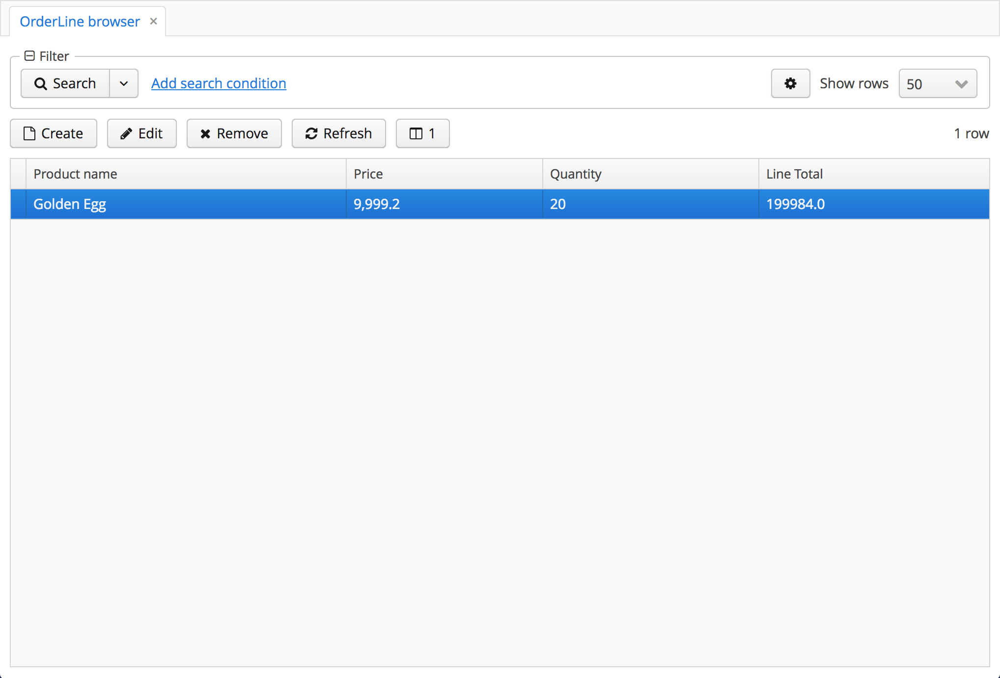
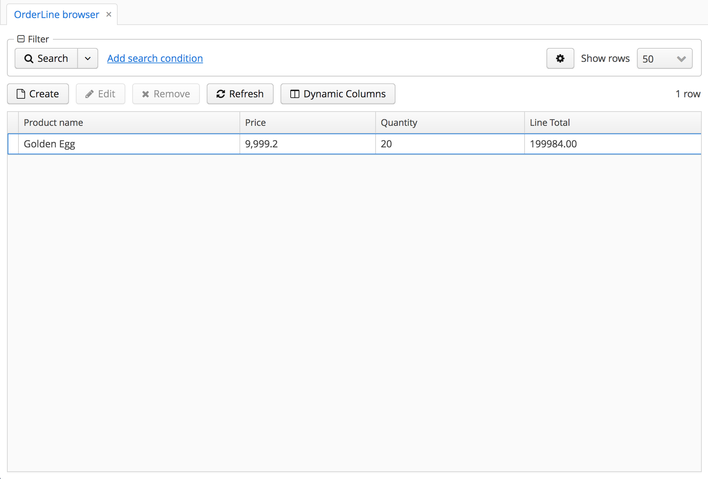
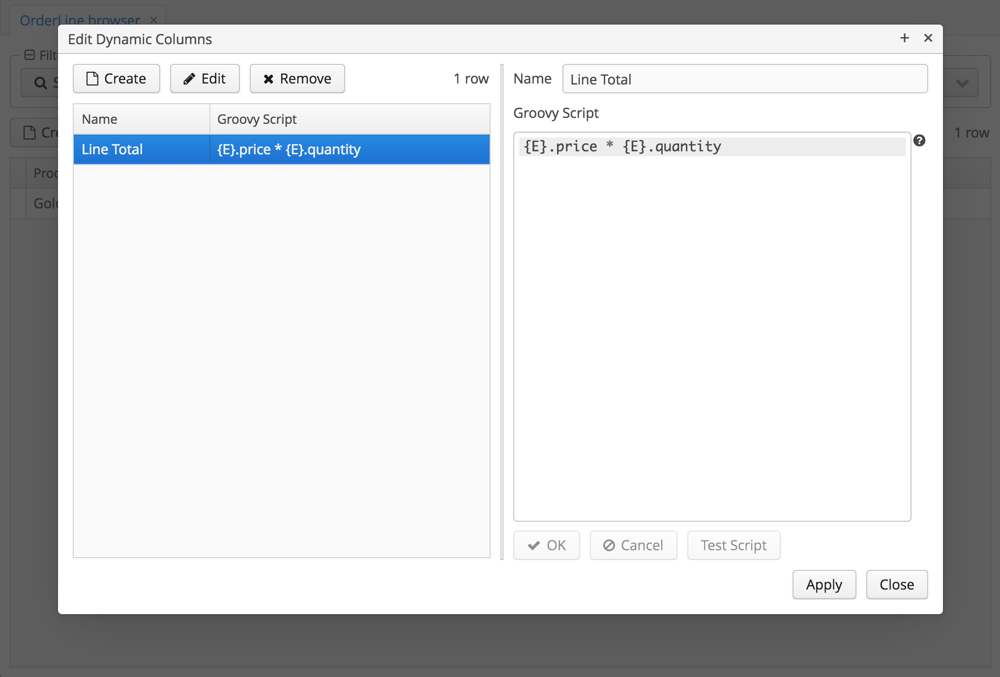

[](http:s//www.apache.org/licenses/LICENSE-2.0)
[](https://semver.org/spec/v2.0.0.html)
[](https://www.cuba-platform.com/marketplace/dynamic-columns)

# CUBA Dynamic Columns Add-on

A CUBA Framework add-on component that adds dynamic columns support (user created) for Table components. 
**NOTE**: only the `web` module is supported.

Basically it provides a custom action that you can add to your table components,
and associate to a button (or context menu item, or whatever you want) that when triggered
display a dialog where the user can add/edit/remove dynamic columns whose value is generated
by a Groovy script.

## Installation

**NOTE: This add-on's repository is officially linked to the main CUBA repository.**

*You can jump straight to step 2. for instructions on how to add it to your project*, or *optionally*
you can choose to add my repository to your project's repositories.  

1. [*OPTIONAL*] Add the following maven repository `https://dl.bintray.com/pfurini/cuba-components` to the build.gradle of your CUBA application:

```
buildscript {
    
    //...
    
    repositories {
    
        // ...
    
        maven {
            url  "https://dl.bintray.com/pfurini/cuba-components"
        }
    }
    
    // ...
}
```

Alternatively you can use **CUBA Studio** to add it: just go to the `PROJECT PROPERTIES` section,
click `Edit`, then click on the cog icon next to the `Repository` field.
In the dialog that opens, click on `+ Add` and enter `https://dl.bintray.com/pfurini/cuba-components`
in the `URL` field, then click `OK`. Finally, select the just added repository in the upper list,
and click `Use in the project` button, and then press `OK`.

2. Select a version of the add-on which is compatible with the platform version used in your project:

| Platform Version | Add-on Version | Coordinates
| ---------------- | -------------- | -----------
| 6.8.x            | 1.0.0          | it.nexbit.cuba.dynamiccolumns:nxdcol-global:1.0.0
| 6.9.x            | 1.1.0          | it.nexbit.cuba.dynamiccolumns:nxdcol-global:1.1.0
| 6.10.x           | 1.2.0          | it.nexbit.cuba.dynamiccolumns:nxdcol-global:1.2.0

The latest stable version is: `1.2.0` for CUBA 6.10

Add custom application component to your project. Using **CUBA Studio**, go to `PROJECT PROPERTIES` -> `Edit` and click `+` next to `Custom components`,
then paste into the first field the appropriate coordinates for the desired version, picked from the table above.

## Supported DBMS engines

_N/A_ - This component does not add any new table. It relies on the `UserSettingService` and its underlying
table (`SEC_USER_SETTING`).

## Created tables

_NONE_

## Usage

### Configuration

Some component behaviour can be altered by means of configuration properties.

#### Application properties

The following properties can be set in `*.properties` files (typically in your `web-app.properties` file).
For programmatic access use the `DynamicColumnsConfig` interface. 

| Property                                       | Default Value                       | Description                                              |
| ---------------------------------------------- | ----------------------------------- | -------------------------------------------------------- |
| nxdcol.editActionShortcut                      | CTRL-ALT-D                          | The keyboard shortcut associated with the `editDynamicColumns` action   

### How to use in your project

The component is designed to enhance the `Table` components in a `web` module.

To use it, create a new browse screen or open an existing one in your project, then add the `<yourTableId>.editDynamicColumns`
 like in the following example:
 
```xml
...
<groupTable id="orderLinesTable"
            width="100%">
    <actions>
        <action id="create"/>
        <action id="edit"/>
        <action id="remove"/>
        <action id="refresh"/>
    </actions>
    <columns>
        <column id="productName"/>
        <column id="price"/>
        <column id="quantity"/>
    </columns>
    <rows datasource="orderLinesDs"/>
    <rowsCount/>
    <buttonsPanel id="buttonsPanel"
                  alwaysVisible="true">
        <button id="createBtn"
                action="orderLinesTable.create"/>
        <button id="editBtn"
                action="orderLinesTable.edit"/>
        <button id="removeBtn"
                action="orderLinesTable.remove"/>
        <button id="refreshBtn"
                action="orderLinesTable.refresh"/>
        <!-- WE ARE ADDING THE ACTION TO A BUTTON IN THE TABLE'S BUTTONSPANEL -->
        <button id="editDynamicColsBtn"
                action="orderLinesTable.editDynamicColumns"/>
    </buttonsPanel>
</groupTable>
...

``` 

Now you need to inject the action to your table. For this you need to put some code in the screen's
controller:

```java
public class OrderLineBrowse extends AbstractLookup {

    /* 
       The @InjectDynamicColumnsAction can be added to any table field in your controller,
       and it accepts an optional `dynamicCaption` argument.
       The default value is `true` if omitted, but you can set it to `false` like in the 
       following example.
       When `dynamicCaption` is `true`, the Caption of the GUI component associated to the action
       (in our case a Button) becomes an integer, that represents the number of dynamic columns
       defined for the associated table (starting from 0).
     */ 
    @InjectDynamicColumnsAction(dynamicCaption = false)
    @Inject
    private GroupTable<OrderLine> orderLinesTable;

    @Override
    public void init(Map<String, Object> params) {

        // ... other init code here ...
        
        // the following line initialises the actions for all table components marked with the
        // @InjectDynamicColumnsAction attribute. Put this at the end of your `init()` method.
        DynamicColumnsManager.inject(this);
    }

}
```

That's it! The following screenshot shows the browse screen with one Dynamic Column and a `dynamicCaption`
enabled button:



While the following is the same browse screen but with `dynamicCaption = false`:



Clicking on the `Dynamic Columns` button opens a dialog where each user can add/edit/remove own dynamic columns,
for that specific table in that specific screen. Every user has their unique settings.




### Extending

The `dynamic-column-browse` screen can be extended in the usual CUBA way, so you can alter the
standard behaviour to better suit your needs.

The component registers the following beans, that you can override in your project:

- `nxdcol_EditDynamicColumnsAction` - *prototype* component implemented by the `EditDynamicColumnsAction` class
- `nxdcol_DynamicColumnsManager` - *prototype* component which interface is `DynamicColumnsManager` and
implemented by the concrete class `DynamicColumnsManagerImpl`